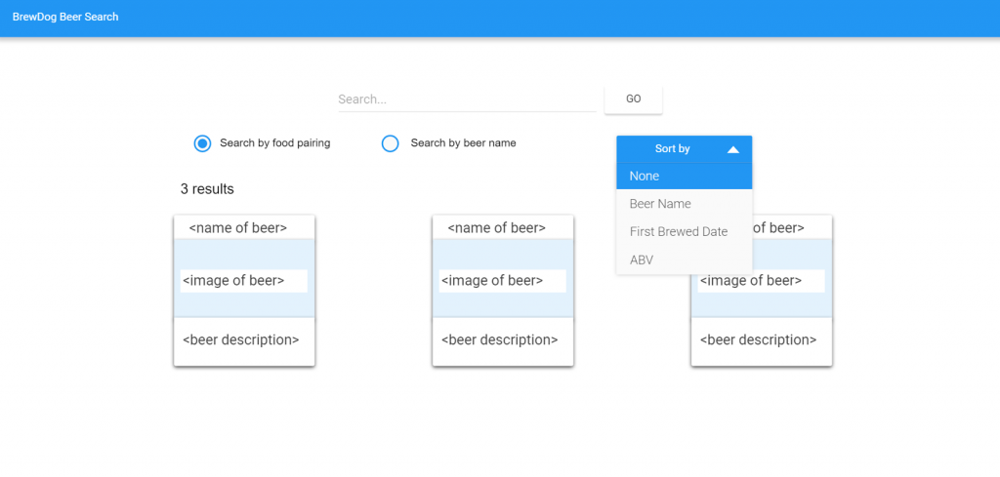

# Coding Exercise

This is a simple frontend demonstration to hit the BrewDog API.

I'm erring on the side of overkill with some of the features, but it's been good practice since I've been doing a lot of python lately. For example, I wrote this in React, but something this simple could have easily been mocked up in vanilla JS.

#### Features
- [x] Redux
- [x] Webpack with Hot Reload
- [x] Redux thunk async actions

---
 

# Home Coding Exercise - BrewDog Beer Search

Create a search landing page to query BrewDog’s beer catalogue and display the search results. Feel free to use any client-side frameworks, libraries, etc. that you want.

### Part 1 - Page Layout

Use this wireframe as a guideline for the layout of the search page. How the page is styled is not a requirement, but it would be a good opportunity to showcase your design chops.

#### Page UI requirements:
- Search input field
- Submit button
- Two radio buttons - one to search by food pairing and one to search by beer name
- Dropdown menu to sort the results - selection defaults to “None”
- Menu items: None, Beer Name, First Brewed Date, ABV
- Search results list
- Page must be responsive - the size and layout of elements should adjust based off screen size

### Part 2 - Search API

Use Punk API for querying BrewDog’s beer catalogue. Their API documentation can be found here - https://punkapi.com/documentation/v2.

Queries are performed by doing a simple GET request to their API endpoint. Requests can include URL parameters. The parameters needed for the two search options are “food” and “beer_name”.

The “Sort by” options map to properties of the beer object as follows: Beer Name = beer_name, First Brewed Date = first_brewed, ABV = abv.

When the submit button is clicked or the enter key is pressed with the search input field in focus, any previous search results should be removed and the new query should be performed. The selected radio button will determine which URL parameters are used. If it’s search by food, use the “food” parameter. If it’s search by name, use the “beer_name” parameter.

#### Search requirements:
- On submit, if the input field is empty, display an error message notifying that a search term is required (how that message is displayed is up to you)
- The API request must be asynchronous
- A loading indicator must be displayed while the request is being performed
- Display the number of results returned
- If no results are returned, display a message that nothing was found
- If a sort by option was specified, apply the sort to the results before displaying them
    - Note: Punk API doesn’t have parameters for sorting, so this should be handled client-side

### Part 3 - Search Results

The search results list should display the following info about each beer:

- Name
- Image
- First brewed date
- Description
- ABV

Refer to the Punk API documentation for the actual property names of the beer object.

When the sort by option is changed, any existing results should update to the new sort order (bonus points if you include a slick re-sort animation).

#### Bonus Features

If you want do a bit more to show off your mad skillz, you can implement any of the following (or any additional features you think would highlight your abilities).
- Ability to save your favorite beers - e.g. save selections to local storage
- Make the beers clickable and on click, expand or popup a modal with the full details of the beer
- Search by brewed before/after date range, set via a datepicker
- Pagination controls - the default page size is 25 but can be increased via URL parameter
- Save the state of the page so that refreshing returns you back to where you left off
